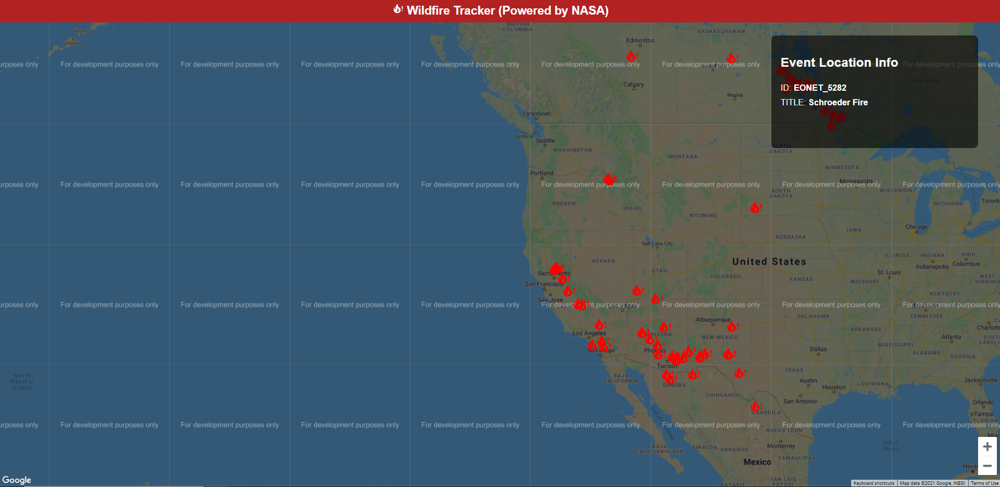

# Wild Fire Tracking Application

Built using React calling to the Google Maps API along with using NASA's EONET: Earth Observatory Natural Event Tracker

- [NASA: EONET API](https://eonet.sci.gsfc.nasa.gov/docs/v2.1)

